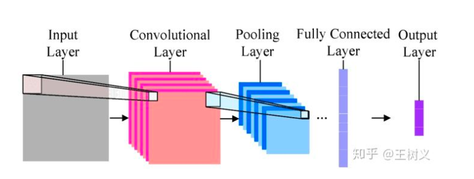
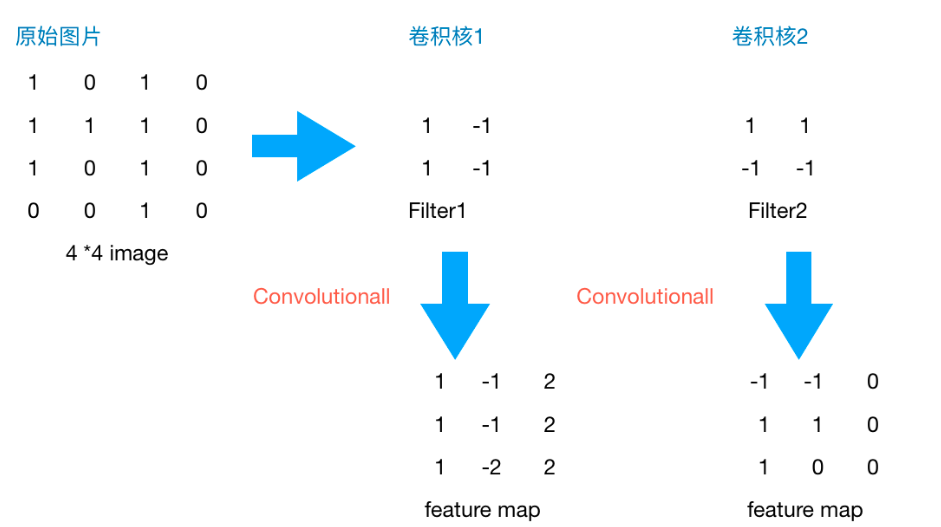

#### ** 为什么要使用深度学习 **

+ ##### 特征工程高效性

神经网络的出现使我们不需要做大量的特征工程，譬如提前设计好特征的内容或者说特征的数量等等，我们可以直接把数据灌进去，让它自己训练，自我“修正”，即可得到一个较好的效果。

+ ##### 数据格式的简易型

神经网络里我们不需要额外的对数据做过多的处理，比如归一化和格式转化。
+ ##### 调参容易

我们只需要初始化时给每一个神经元上随机的赋予一个权重w和偏置项b，在训练过程中，这两个参数会不断的修正，调整到最优质，使模型的误差最小。所以从这个角度来看，我们对于调参的背后理论知识并不需要过于精通 。
+ ##### 传统神经网络缺点

全连接模型复杂，神经元多，参数多，调参难

####  ** CNN **

+ ##### 卷积层
只用设计好卷积核的尺寸，数量和滑动的步长就可以让它自己去训练了，省时又省力啊。.每一层的卷积核大小和个数可以自己定义，不过一般情况下，根据实验得到的经验来看，会在越靠近输入层的卷积层设定少量的卷积核，越往后，卷积层设定的卷积核数目就越多。

+ ##### 池化层
  池化方法一般有一下两种：

+ 取滑动窗口里最大的值

+ 取滑动窗口内所有值的平均值
  如果加了Max Pooling后效果反而变差了，不如把卷积后不加Max Pooling的结果与卷积后加了Max Pooling的结果输出对比一下，看看Max Pooling是否对卷积核提取特征起了反效果。

  **Zero Padding**

  为了防止图片在卷积和池化后越变越小这个时候我们就会引出“Zero Padding”（补零），它可以帮助我们保证每次经过卷积或池化输出后图片的大小不变。

  

+ ##### Flatten层 & Fully Connected Layer

  做完Max Pooling后，我们就会把这些数据“拍平”，丢到Flatten层，然后把Flatten层的output放到full connected Layer里，采用softmax对其进行分类。


百度paddle代码：

```python
def convolutional_neural_network_org(img):
    # first conv layer
    conv_pool_1 = paddle.networks.simple_img_conv_pool(
        input=img,
        filter_size=3,
        num_filters=20,
        num_channel=1,
        pool_size=2,
        pool_stride=2,
        act=paddle.activation.Relu())
    # second conv layer
    conv_pool_2 = paddle.networks.simple_img_conv_pool(
        input=conv_pool_1,
        filter_size=5,
        num_filters=50,
        num_channel=20,
        pool_size=2,
        pool_stride=2,
        act=paddle.activation.Relu())
    # fully-connected layer
    predict = paddle.layer.fc(
        input=conv_pool_2, size=10, act=paddle.activation.Softmax())
    return predict
```

第一层我们采取的是 `3*3` 的正方形卷积核，个数为20个，深度为1，stride为2，pooling尺寸为 `2*2`，激活函数采取的为RELU；第二层只对卷积核的尺寸、个数和深度做了些变化，分别为 `5*5` ，50个和20；最后链接一层全连接，设定10个label作为输出，采用Softmax函数作为分类器，输出每个label的概率