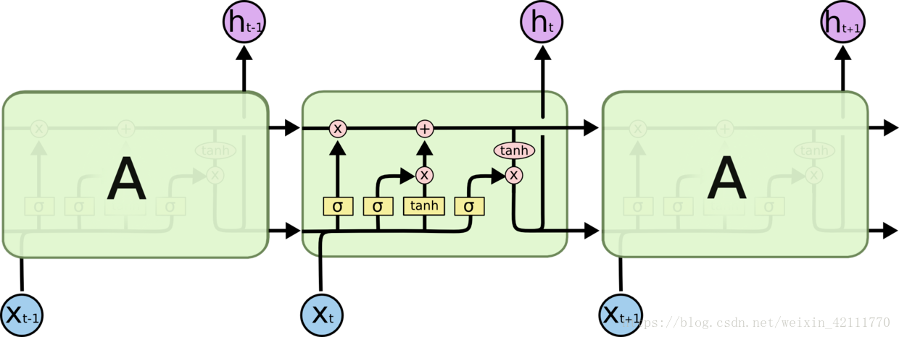
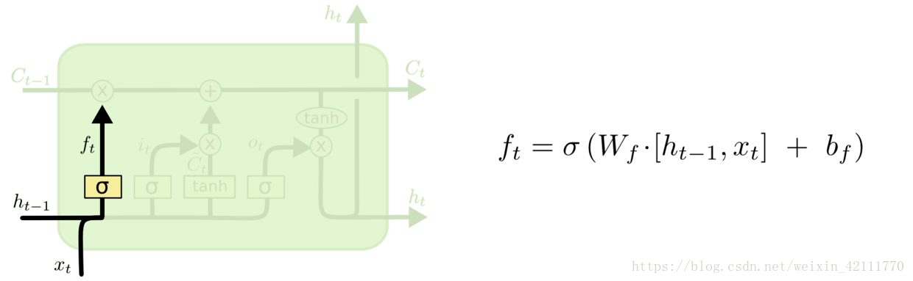
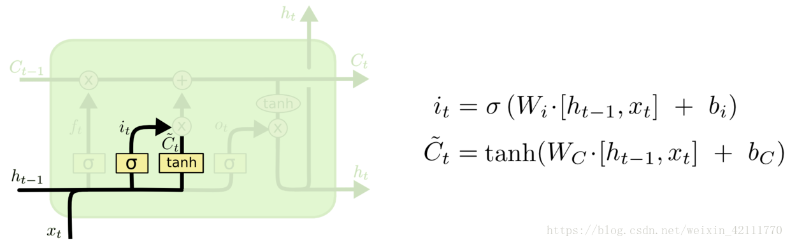
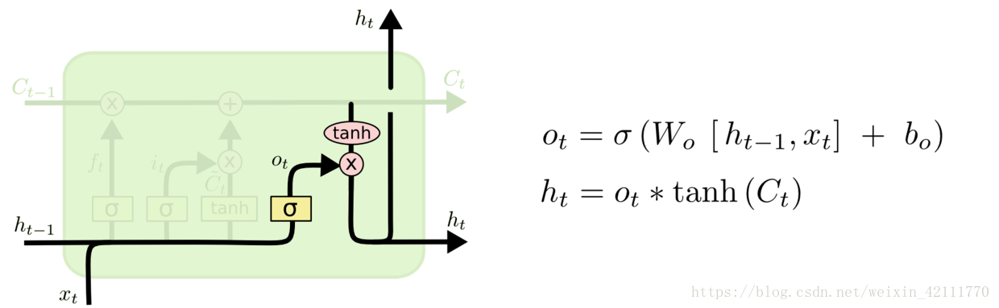
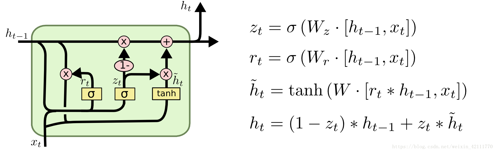

#### 长短期记忆(LSTM)以及变体双向LSTM和GRU
+ ##### 概述
LSTM（Long Short-Term Memory）长短期记忆网络，是一种时间递归神经网络，适合于处理和预测时间序列中间隔和延迟相对较长的重要事件。LSTM是解决循环神经网络RNN结构中存在的“梯度消失”问题而提出的，是一种特殊的循环神经网络。

贯穿在图上方的水平线为细胞状态（cell），黄色的矩阵是学习得到的神经网络层，粉色的圆圈表示运算操作，黑色的箭头表示向量的传输，整体看来，不仅仅是h在随着时间流动，细胞状态c也在随着时间流动，细胞状态c代表着长期记忆。

在LSTM中，第一阶段是遗忘门，遗忘层决定哪些信息需要从细胞状态中被遗忘，下一阶段是输入门，输入门确定哪些新信息能够被存放到细胞状态中，最后一个阶段是输出门，输出门确定输出什么值。

+ ##### 遗忘门
  遗忘门：遗忘门是以上一层的输出和本层要输入的序列数据作为输入，通过一个激活函数sigmoid，得到输出为。的输出取值在[0,1]区间，表示上一层细胞状态被遗忘的概率，1是“完全保留”，0是“完全舍弃”。
  
  $f_t=\sigma(W_f*[h_{t-1},x_t]+b_f)$

+ ##### 输入门
输入门包含两个部分，第一部分使用sigmoid激活函数，输出为，第二部分使用tanh激活函数，输出为。【个人通俗理解：在RNN网络中就是本层的输出，是在[0,1]区间取值，表示中的信息被保留的程度，表示该层被保留的新信息】

$i_t=\sigma(W_i*[h_{t-1},x_t]+b_i)$
$\hat{C}_t=tanh(W_c*[h_{t-1},x_t]+b_c)$

+ ##### 输出门

$o_t=\sigma(W_o*[h_{t-1},x_t]+b_o)$
$h_t=o_t*tanh(C_t)$
  
#### 双向LSTM

由于双向LSTM能够同时利用过去时刻和未来时刻的信息，会比单向LSTM最终的预测更加准确。

#### GRU
GRU（Gated Recurrent Unit）**是LSTM最流行的一个变体，比LSTM模型要简单。
GRU包括两个门，一个重置门和更新门。这两个门的激活函数为sigmoid函数，在[0,1]区间取值。
 

候选隐含状态使用重置门来控制t-1时刻信息的输入，如果结果为0，那么上一个隐含状态的输出信息将被丢弃。也就是说，重置门决定过去有多少信息被遗忘，有助于捕捉时序数据中短期的依赖关系。
隐含状态使用更新门对上一时刻隐含状态和候选隐含状态进行更新。更新门控制过去的隐含状态在当前时刻的重要性，**如果更新门一直趋近于1，t时刻之前的隐含状态将一直保存下来并全传递到t时刻，**更新门有助于捕捉时序数据中中长期的依赖关系。