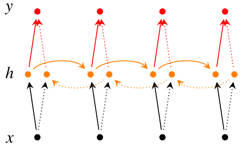

#### RNN原理
既然我们已经有了人工神经网络和卷积神经网络，为什么还要循环神经网络？  原因很简单，无论是卷积神经网络，还是人工神经网络，他们的前提假设都是：元素之间是相互独立的，输入与输出也是独立的，比如猫和狗。  但现实世界中，很多元素都是相互连接的。因此，就有了现在的循环神经网络，他的本质是:** 像人一样拥有记忆的能力 **因此，他的输出就依赖于当前的输入和记忆。

每个圆圈可以看作是一个单元，而且每个单元做的事情也是一样的，因此可以折叠呈左半图的样子。用一句话解释RNN，就是**一个单元结构重复使用**。
$X_t$：表示t时刻的输入，$O_t$ :表示t时刻的输出，$S_t$:表示t时刻的记忆。

因为我们当前时刻的输出是由**记忆**和**当前时刻**的输入决定的，神经网络最擅长做的就是通过一系列参数把很多内容整合到一起，然后学习这个参数，因此就定义了RNN的基础：
$S_t=f(U*X_t+W*S_{t-1})$

$f()$函数是套用一个激活函数，来做一个非线性映射，来过滤和遗忘不重要的信息。
而预测结果需要带着当前时刻的记忆去预测，预测不能直接带用一个矩阵来预测呀，所以预测的时候还要带一个权重矩阵V,这里举例用softmax函数来表示为:
$O_t=softmax(VS_t)$

RNN中的结构细节： 1.可以把St当作隐状态，捕捉了之前时间点上的信息。就像你去考研一样，考的时候记住了你能记住的所有信息。 2.Ot是由当前时间以及之前所有的记忆得到的。就是你考研之后做的考试卷子，是用你的记忆得到的。 3.很可惜的是，St并不能捕捉之前所有时间点的信息。就像你考研不能记住所有的英语单词一样。 4.和卷积神经网络一样，这里的网络中每个cell都共享了一组参数（U，V，W）,这样就能极大的降低计算量了。 5.Ot在很多情况下都是不存在的，因为很多任务，比如文本情感分析，都是只关注最后的结果的。就像考研之后选择学校，学校不会管你到底怎么努力，怎么心酸的准备考研，而只关注你最后考了多少分。
#### 双向RNN

$O_t=softmax(V*[S^1_t;S^2_t])$